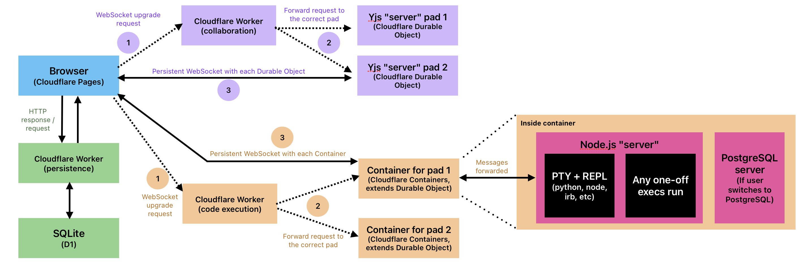

# Architecture

This document describes the production system design of The SPOT Editor: how the pieces fit together, why they are separate, and the tradeoffs behind the main technology choices.

The first version of this app ran locally: Vite + a `y-websocket` Node server, a Flask API over PostgreSQL, and a Node execution server that orchestrated Docker containers with Dockerode. Production keeps the same four-layer shape (frontend, collaboration, persistence, execution) and moves each layer onto Cloudflare. The local `apis/` directory you'll see in the `development` branch is the prototype; `workers/` is what serves real traffic from the `main` branch.

---

## Table of Contents

- [System Overview](#system-overview)
- [Component Breakdown](#component-breakdown)
  - [Frontend](#frontend)
  - [Collaboration Layer](#collaboration-layer)
  - [Persistence Layer](#persistence-layer)
  - [Code Execution Layer](#code-execution-layer)
- [Data Model](#data-model)
- [Session Generations](#session-generations)
- [Key Design Decisions](#key-design-decisions)
- [Roadmap](#roadmap)

---

## System Overview

What travels where:

- **Inside the browser, Monaco is bound to Yjs via `MonacoBinding`.** Keystrokes go Monaco → `Y.Text` → `y-partyserver` provider → the pad's Durable Object. The same `Y.Doc` also has a `Y.Map` whose `language` key syncs the dropdown across users.
- **The browser terminal is xterm.js.** It opens a second WebSocket to the execution Worker. That Worker does not run the REPL itself; it forwards the connection to the pad's Container.
- **Persistence is ordinary HTTP.** Debounced saves, language changes, and last-user-leave writes go to the Hono Worker, which reads and writes D1. This API does not know about Yjs or terminals.

The three Workers share one D1 database (`collab-pads`). Persistence owns pad content. Collaboration and execution use D1 only to check that a pad exists and to read/write the current **generation ID** (see [Session Generations](#session-generations)).

---

## Component Breakdown

### Frontend

**Built with:** Vite + vanilla JavaScript, hosted on Cloudflare Pages  
**Entry point:** `index.html` → `src/js/main.js`

`main.js` is the orchestrator: it initializes each module, wires event listeners, and sequences async work that has to happen in order (name modal before Monaco, look up latest pad language before WebSocket setups, Yjs sync before seeding content).

This is not a routed SPA. Pages serves the same `index.html` for every `/pads/:id` URL. The client reads the pad ID from `window.location.pathname` and connects to the matching rooms. Unknown IDs get a 404 from the persistence API, and the client sends the user to `invalid.html`.

| Module | Responsibility |
|---|---|
| `editor.js` | Monaco instance and per-language models |
| `collaboration.js` | `Y.Doc`, `y-partyserver` provider, awareness, `MonacoBinding` lifecycle |
| `persistence.js` | Thin REST client - `GET` / `PATCH` against the persistence Worker |
| `output.js` | HTML preview pane (sandboxed iframe) |
| `resizer.js` | Draggable divider and associated math, 150 px minimum pane width |
| `modal.js` | Name prompt, shown on first visit per browser |
| `username.js` | Validation helpers shared by the modal and inline name editing |
| `terminal.js` | xterm.js UI and the execution WebSocket |

**Monaco web workers.** Monaco offloads syntax analysis, JS/TS IntelliSense, and formatting to web workers so typing stays responsive. `MonacoEnvironment.getWorker` in `editor.js` picks a JavaScript/TypeScript worker, an HTML worker, or the generic editor worker.

---

### Collaboration Layer

**Built with:** Yjs, y-partyserver / partyserver, y-monaco  
**Worker:** `workers/collaboration/`  
**Frontend class:** `ConnectionManager` in `collaboration.js`

`y-websocket` is a Node library. Cloudflare Durable Objects run in V8 isolates, not Node, so the production server is PartyKit's `YServer` (Cloudflare acquired PartyKit in 2024) rather than our own Yjs server.

**Request path**

1. The browser opens a WebSocket to the collaboration Worker with a PartyKit room name `room-<padId>`.
2. The Worker extracts the pad ID, rejects unknown pads, increments `join_count`, and loads or creates a generation ID.
3. It rewrites the path to `room-<padId>-<generationId>` and hands the request to `routePartykitRequest`, which routes to the Durable Object for that room.

**Inside the Durable Object**

`MyYServer` extends `YServer`. PartyKit handles the WebSocket, Yjs binary sync, awareness, and the in-memory `Y.Doc`. When the last client disconnects, the Worker:

- Clears the pad's generation ID in D1, so the next group gets a new object
- Deletes Durable Object storage (including any alarm) so generation-scoped objects do not accumulate forever

Hibernation is **off** (`static options = { hibernate: false }`). With hibernation on, PartyKit's in-memory connection tracking and Yjs state got out of sync across browsers after the ~10 second idle window. That is a known cost, as idle tabs keep the isolate alive, and one that I anticipate to be acceptable but will monitor.

**Document shape (browser)**

Each client holds one `Y.Doc`:

- **One `Y.Text` per language** (`monaco-python`, `monaco-javascript`, …), each bound to a Monaco model via `MonacoBinding`. Switching languages swaps the active model; it does not wipe the previous language's text.
- **One `Y.Map`** with a `language` key, so a dropdown change is shared.

**Awareness** carries ephemeral state that should not be persisted: display name and cursor color. Presence lives only in memory on the Durable Object. When everyone leaves, it is gone, which is what we want.

---

### Persistence Layer

**Built with:** Hono on a Cloudflare Worker, D1 (SQLite)  
**Location:** `workers/persistence/`  
**Frontend module:** `src/js/persistence.js`

A stateless REST API. It does not know about Yjs, rooms, or users. Its job is durable storage.

| Method | Path | Purpose |
|---|---|---|
| `POST` | `/api/pads` | Create a pad (auth-gated) |
| `GET` | `/api/pads/:padId` | Current language |
| `PATCH` | `/api/pads/:padId` | Update current language |
| `GET` | `/api/pads/:padId/content/:language` | Saved content for a pad/language pair |
| `PATCH` | `/api/pads/:padId/content/:language` | Save content for a pad/language pair |
| `GET` | `/api/pads/:padId/generation` | Get or create the live generation ID |
| `DELETE` | `/api/pads/:padId/generation` | Clear the generation ID |

The collaboration and execution Workers currently talk to D1 **directly** for pad existence and generation IDs, rather than calling these last two HTTP endpoints. This is the preferred behavior for communication between two Cloudflare resources, as it is much quicker than going through multiple hops through the persistence Worker and API. The endpoints exist on the persistence Worker as well in case they are ever needed.

Pad IDs are 8-character nanoid strings using the same alphabet as the original Python `shortuuid` generator. Create is the only authenticated route (`Authorization: Bearer <AUTH_TOKEN>`). CORS is locked to `FRONTEND_URL`.

See [`workers/persistence/README.md`](workers/persistence/README.md) for setup, tests, and the full API reference.

---

### Code Execution Layer

**Built with:** Cloudflare Worker + Container (Durable Object), Node.js, `ws`, `node-pty`  
**Worker:** `workers/execution/`  
**In-container code:** `workers/execution/container/`  
**Frontend module:** `src/js/terminal.js`

This is a second WebSocket, independent of Yjs. Each client connects with `padId` and `language` as query parameters.

**Request path**

1. The browser opens a WebSocket to the execution Worker.
2. The Worker checks the pad exists, loads or creates the same generation ID the collaboration Worker uses.
3. Cloudflare starts (or reuses) that pad's container based on the pad ID and generation ID. The Container class proxies the WebSocket to the Node server listening on port 8080 inside the image.

The Worker is the receptionist. The container is the room.

**Inside the container**

Cloudflare Containers do not expose Dockerode's `exec` + `Tty: true` API, and the Sandbox SDK was still in preview when this was built (and would not have let us run our own Postgres code and server). The image therefore starts a Node server instead. Instead of having one Node server that manages multiple containers, each container now starts its own Node server.

| Piece | Role |
|---|---|
| `ReplServer` | Handles Cloudflare HTTP `/ping` plus a `ws` server. One process = one pad, so there is a single `PadSession` object, not a map of pad IDs. |
| `PadSession` | Shared terminal output log, current PTY, optional one-off run, Postgres-started flag, broadcast logic to all connected sockets. |
| `PtyManager` | `node-pty` for the REPL; `child_process.spawn` for one-off runs; `child_process.exec` for Postgres startup. |

Cloudflare starts and stops the VM. We do not create, start, or kill containers ourselves. First-joiner setup solves for a race condition where two sockets can arrive before `this.session` exists, so setup creates a shared Promise instead that concurrent joiners await.

**The REPL:** For non-HTML languages, `node-pty` spawns the runtime (`python3`, `node`, `irb`, `ts-node`, or `psql`) as the unprivileged `sandbox` user. Frontend keystrokes arrive and are written to the PTY. PTY output is broadcast to every client in the pad. Because the REPL echoes input, everyone sees typing without a separate input broadcast.

**Run:** The Run button does **not** feed code into the PTY. `spawn` starts a separate process (`python3 -c`, `node -e`, …) with stdin closed and stdout/stderr piped. Limits per run:

- **Timeout:** 15 seconds
- **Output cap:** 512 KB of incremental output

REPL output is suppressed for the duration of the run so PTY echo does not interleave with the one-off output. `spawn` is used instead of `exec` because some programs (for example JS `setTimeout`) do not finish immediately.

**Language switch:** Receiving a `languageChange` message kills the current PTY and starts a new one in the same container. HTML starts no PTY. Output log is cleared.

**SQL:** Postgres is not running at container start. When a user switches the language to SQL, we start the Postgres server, wait until the server is ready, and then creates a `studentdb` database owned by the `student` role. This startup only happens upon the first language change trigger, and future language switches back to SQL skip startup. The image disables TCP listen, SSL, and `/dev/shm`-backed DSM (`dynamic_shared_memory_type = mmap`) because Cloudflare Containers do not provide a usable `/dev/shm`.

**Idle teardown:** A Container's `sleepAfter` timer (here `"7s"`) starts only after **all WebSockets are closed**. A forgotten background tab would keep the VM - and the bill - alive. `ReplServer` therefore closes every socket after **10 minutes with no WebSocket message from any connection**. `SIGTERM` / `SIGINT` handlers let Node exit so Cloudflare can actually stop the container. `onStop` on the Durable Object deletes its SQLite storage so generation-scoped objects do not pile up.

**Concurrency:** `wrangler.jsonc` sets `max_instances: 20` and `instance_type: "lite"`. Combined with fixed (auth-created) pad IDs, that keeps a refresh loop from exhausting the account's container slots.

**Security:** Cloudflare isolates containers (gVisor / microVMs); we do not run gVisor ourselves. On top of that:

| Constraint | How |
|---|---|
| Network | `enableInternet = false` on the Container class |
| User code | PTY and one-off processes run as `sandbox` (non-root) via `node-pty` / `spawn` `uid` |
| Run limits | 15 s timeout, 512 KB output, process-group kill on stop |

---

## Data Model

Two tables in D1 (SQLite). Timestamps are stored as `text` (`CURRENT_TIMESTAMP` / ISO-like strings) because D1 has no `timestamptz`.

### `pads`

| Column | Type | Notes |
|---|---|---|
| `id` | `text` (PK) | 8-character nanoid |
| `current_language` | `text` | Not null, check-constrained to the six supported languages |
| `generation` | `text` | Live session ID, or `NULL` when no group is in the pad |
| `join_count` | `integer` | Default 0, incremented on each collaboration connect |
| `created_at` | `text` | Set on insert |
| `updated_at` | `text` | Updated on language change, generation ID change, join count change |

### `pad_contents`

| Column | Type | Notes |
|---|---|---|
| `id` | `integer` (PK) | Surrogate key |
| `pad_id` | `text` (FK → `pads.id`) | Not null, cascading delete |
| `language` | `text` | Not null, check-constrained to the six supported languages |
| `content` | `text` | Nullable if no content yet for this language |
| `updated_at` | `text` | Updated on each save |

`UNIQUE (pad_id, language)` ensures at most one content row per pair. A row is created on first access for that pad/language, not at pad creation, so the table stays sparse. One pad can have up to six content rows for each unique language.

---

## Session Generations

Durable Objects (and Containers, which extend them) are addressed by ID. If that ID is only the pad ID, Cloudflare places the object near the **first user who ever opened that pad**, and it stays there.

This behavior is not ideal for our use case. Study groups are not always between students who are located in the same place. A US group on Monday and a European group on Tuesday should not both pay the latency of a Durable Object that happens to live in Virginia.

To solve for this, we generate a separate ID, called a "generation ID" to append onto the pad ID, which essentially forces Cloudflare to create a new Durable Object in a more guaranteed advantageous location for the students using the pad for that study session.

The routing key is `padId + generationId`:

1. First joiner of a quiet pad: `UPDATE pads SET generation = ? WHERE id = ? AND generation IS NULL`, then `SELECT generation`. The `WHERE generation IS NULL` clause is the race control- two simultaneous first joiners share one ID instead of each writing their own.
2. Collaboration rewrites the PartyKit room to `room-<padId>-<generationId>`. Execution looks up `getContainer(..., "<padId>-<generationId>")`. Both Workers look within the same D1 column.
3. When the last Yjs client disconnects, collaboration sets `generation` back to `NULL`. The next group gets a new UUID and a new object, placed near the user who joins first next time.

This is also why Durable Object storage is deleted on close/stop: generations are meant to be ephemeral. Pad *content* lives in D1, not in the object.

Containers don't have this same issue, as Cloudflare notes in its documentation that Cloudflare will try to find the nearest "free" instance of the Container and start an instance there, provided the container wasn't in use prior to the new incoming request. This means that Container instances have the ability to relocate. 

We may not need generation IDs at some point in the future as Cloudflare notes it is working on dynamic relocation of existing Durable Objects.

---

## Key Design Decisions

### Monaco Editor

**Chosen over:** CodeMirror

Monaco matches what students already see in VS Code and ships JS/TS IntelliSense without extra setup. The cost is bundle size. Vite's worker configuration and code splitting help, but Monaco is still large. For a tool that occupies a dedicated tab, that tradeoff is acceptable.

---

### CRDTs and Yjs

When two users type at the same position, local documents diverge. Two mainstream approaches:

- **Operational Transformation (OT)** - Google Docs. A central server imposes a total order and transforms operations. Correct OT is famously hard to implement.
- **CRDTs** - Yjs, Automerge, and others. Replicas merge to the same result regardless of arrival order. The merge logic does not need a primary.

Yjs was chosen because it is a mature CRDT, it binds to Monaco via `y-monaco`, and awareness (cursors, names, colors) is built in. We did not implement YATA ourselves.

**YATA, short version:** the document is a linked list of items. Each item stores a unique ID (client ID + logical clock) and its left/right origins at insert time, not an absolute index. Simultaneous inserts at the same position sort deterministically by client ID. Deletes become tombstones so later inserts relative to deleted characters still resolve.

The server still exists - it relays updates and holds the authoritative in-memory doc for the live session - but it does not transform operations.

---

### Per-language `Y.Text` plus a `Y.Map` for the dropdown

Switching Python → JavaScript must not wipe the Python buffer. Each language is its own `Y.Text` inside one `Y.Doc`, plus a matching Monaco model and a cached `MonacoBinding`. The active language is a `Y.Map` value: it needs to sync, but it is not collaborative text.

Terminal output used to be a candidate for that map. It now lives only on the execution server (broadcast + replay). Mixing REPL bytes into the CRDT was the wrong owner.

---

### Debounced saves, local edits only

Content is written to D1:

1. When the last user leaves (`beforeunload` + `fetch` with `keepalive: true`)
2. When anyone changes language (save the old language first)
3. While typing, on a **3-second debounce**

Saves are skipped for remote Yjs transactions (`transaction.local === false`), so N users do not write the same bytes N times. A crash can lose at most ~3 seconds of work, not a whole interval-based window.

`beforeunload` is unreliable for async work. `keepalive: true` asks the browser to finish the `PATCH` after the page is gone. `navigator.sendBeacon` cannot send a JSON `PATCH`.

---

### First user in the room

The first client must seed the `Y.Doc` from D1. Everyone else must **not**, or they would clobber in-progress work with whatever was last saved.

The check is `users.length <= 1` after the Yjs `sync` event. That creates a cycle: we need a language to initialize the editor, but `Y.Map['language']` is not trustworthy until after sync. Every client therefore fetches the pad's current language over HTTP first (cheap, and it also 404s invalid IDs). Only the first user then writes that language and content into Yjs; others take the synced doc.

---

### Two WebSocket connections

Yjs wants opaque binary updates and awareness. The execution path wants raw terminal I/O, PTY lifecycle, and one-off processes. Those are different servers, different failure domains, and different scaling units and thus deserve separate connections. Restarting a container should not drop editor sync.

---

### Cloudflare everywhere, rather than a hybrid

The prototype could have gone to production as "Pages + Durable Objects for Yjs, and AWS for the rest." One platform won because the three backend pieces have to share identity (pad IDs, generation IDs, CORS, deploy story) and because Cloudflare already had a container product that extends Durable Objects- the same "one object per pad" model as collaboration.

---

### Collaboration - Durable Objects vs a self-hosted WebSocket server vs AWS API Gateway

**Self-hosted Node (Railway, a Lightsail box, etc.):** Fast to stand up. You operate a process, you pick a region, and distant students pay public-internet RTT to that region. One process also multiplexes every pad. This also means we have to maintain a server.

**API Gateway WebSockets + Lambda:** Request/response oriented. Yjs needs a long-lived in-memory room. Recreating that room on every invocation is a lot of machinery for a worse fit.

**Workers + Durable Objects (chosen):** One pad session → one object, with built-in WebSockets. The browser connects to a nearby edge PoP, then traffic rides Cloudflare's backbone to the object. The object itself sits near where *that generation* was created. Scaling is "more pads, more objects," not "bigger WebSocket box."

---

### Generation IDs vs a stable pad-keyed Durable Object

Covered in [Session Generations](#session-generations). The extra D1 column is the price of not freezing pad locality to the first visitor in history.

---

### Fixed pad IDs vs creating a pad on every visit to `/`

Open creation would let anyone refresh `/` and spawn containers. However, this would give users a level of access that could be detrimental- a bad actor may refresh repeatedly and spawn a ton of containers, eating up resources and potentially crowding out other students given we've set account-level `max_instances` to 20. Pads are created only through an authenticated `POST /api/pads`. Students receive links; they do not mint IDs.

---

### Persistence - D1 vs RDS vs SQLite inside each Durable Object

**RDS (Postgres):** Fine relationally; it meant a second cloud, a second credential story, and capacity we do not need: two tables, debounced text writes, no large documents.

**Embedded SQLite in each Durable Object:** Attractive at first- per-pad storage outlives in-memory eviction. However, there are two problems: 1) neither the Yjs object nor the execution object should own persistence (wrong job; Yjs is managed by `y-partyserver`), and 2) putting pad content on the execution object would mean reading notes through the execution Worker. A third "storage-only" object per pad is just a worse D1.

**D1 (chosen):** SQLite, bound to all three Workers, right size for this schema. Collaboration and execution already need "does this pad exist?" so sharing the database is simpler than HTTP hops for that check. SQLite works well for our use case as our database won't be that big (limited number of persistent pads will be created), we won't have "thousands" of simultaneous writers, and the pad content can remain as text. 

---

### Code Execution - Cloudflare Containers vs AWS Fargate vs VPS vs the Sandbox SDK

**VPS:** We would manage a server to run Docker and WebSocket routing to the right pad. This would be close to the prototype we built but comes with the downside of managing our own server + tying the server to a single region.

**AWS Fargate:** While AWS Fargate would allow me to forego managing my own server and would allow me to run separate containers per pad, I would still need to write my own logic to forward WebSocket connections to the correct container. My development Node server used a Map object to connect pad IDs to containers, using Dockerode to spawn new containers. This doesn't quite work with AWS Fargate, as Fargate is the container, and we can't spawn sibling sandboxes within the container. We can start another Fargate task instead, but we still need to map a pad ID to the correct task via some sort of router. In addition, cold starts are slower than we wanted for "first student opens the pad."

**Cloudflare Containers (chosen):** A Container *is* a Durable Object, so routing, lifecycle, and "one per generation" match the collaboration layer. Cloudflare handles isolation for us, so we don't need to implement our own gVisor logic. Cold starts are advertised around 1–3 seconds, although my experience has been on the much lower end of that range. The remaining work - PTY, one-off runs, Postgres, idle disconnect - stays in the Node servers running in each container, which was the point of this being a learning project as well as a product.

**Cloudflare Sandbox SDK:** This is a promising option for the future. It is still in preview as of writing this document, but it would have abstracted away much of the PTY logic I wrote. I chose not to go with this route as I wanted to do a deeper dive myself into the per-container logic, and it would not have let us run a Postgres cluster inside the sandbox, which leaves out students studying PostgreSQL.

---

### PTY via `node-pty`, not a pipe and not Docker exec

REPLs connected to a pipe switch to block-buffered stdout (often 4–8 KB). That is unusable for an interactive REPL experience. A PTY makes the process think it has a real terminal.

Locally, Dockerode's `Tty: true` exec did that from the host. On Cloudflare, we cannot use that same TTY flag, so the Node server *inside* the image calls `node-pty`. Language-specific in-process bridges (Node `repl`, pythonia, …) do not give a real interactive session for every language we need, and Judge0-style batch APIs have no persistent process at all.

---

### One long-lived container per pad session

Rebuilding a container on every language switch would add a noticeable delay. One image installs Python, Ruby, Node, TypeScript (`ts-node`), and PostgreSQL. Language switch = kill old PTY, start new PTY. The container lasts until Cloudflare sleeps it (after our idle disconnect closes the last socket).

---

### One-off `spawn` for Run, not the PTY

Multiline source sent keystroke-by-keystroke into a PTY is echoed and garbled. A separate process runs the buffer atomically. `spawn` (not `exec`) keeps stdout streaming for programs that do not exit immediately. Processes are started `detached` so `kill(-pid)` can reap children the user code spawned.

---

### Custom idle disconnect

`sleepAfter` does not protect against "tab left open." A 10-minute silence timer on the WebSocket server does. That is a product decision as much as a billing one: study sessions go idle; we still need the VM to die.

---

### Hibernation left off on the Yjs Durable Object

See [Collaboration Layer](#collaboration-layer). Correctness of multi-user sync won over isolate thrift. Revisit if idle-tab cost becomes real.

---

## Roadmap

| Item | Notes |
|---|---|
| IntelliSense for Python / Ruby / SQL | Monaco ships JS/TS only. Language servers (e.g. Pyright) via `monaco-languageclient`, ideally in-browser WASM so we do not add another Worker. |
| Multi-file HTML | Vite-style project per pad, closer to Coderpad. Much more state than a single `Y.Text`. |
| Yjs hibernation | Worth another pass if PartyKit / our room lifecycle can be made hibernation-safe. |
| Observability | `join_count` is a start. Execution errors and container starts are the next place a dashboard would help. |
