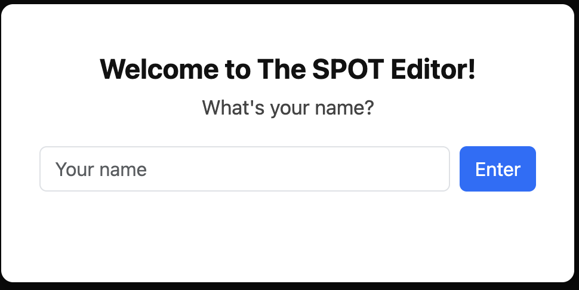
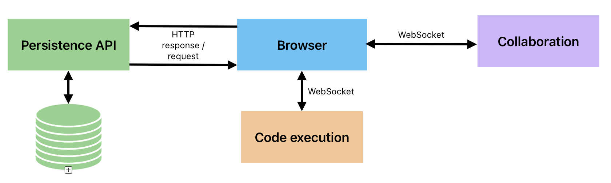
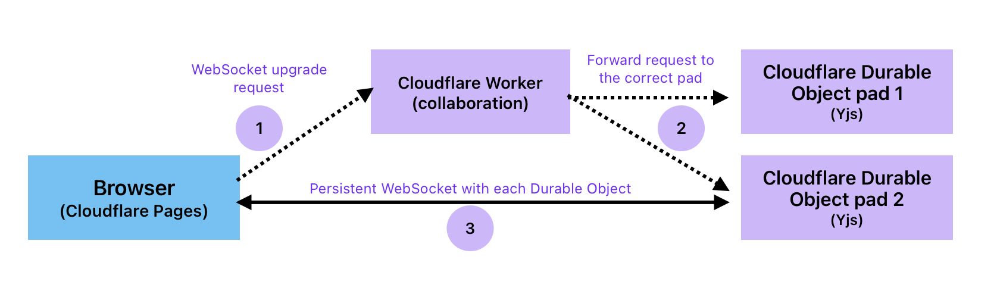
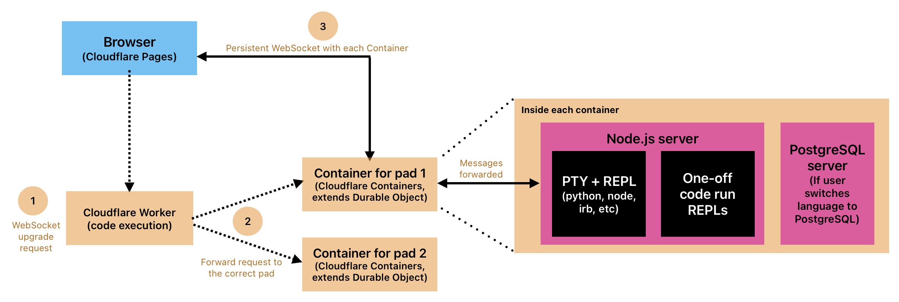

# Introduction

The SPOT Editor is a browser-based collaborative editor created for peer study sessions at Launch School. Each "pad" is differentiated by a unique pad ID, where each pad is its own separate environment. Students who access the same pad can write and run code together in a shared sandbox.

Each pad includes:
- Editor pane: Write code and see code that their peers have written, via color-differentiated cursors per user
- Terminal: View the results of running editor code + access an interactive REPL
- Language options, based on the languages covered in the Launch School curriculum

# Background

At Launch School, students around the world constantly study together. That typically looks like a group of 2-5 students in a video call via the Launch School [Gather](https://www.gather.town) workspace, all working through a problem in a specific [Coderpad](https://coderpad.io/) "pad" where everyone can see and edit the code.

While Coderpad's target market is geared towards interviewing and assessment solutions, its collaborative nature generally worked great for our use case. However, the maintenance process was painful and, honestly, violated ToS- moderators were manually creating new accounts every two weeks to trigger a new free trial period, then manually going into roughly 40 different locations in Gather to replace the old links with new ones.

In addition, given my experience of going through Launch School, I was hoping to use my newfound skills to build a real product that the community can use. Building our own product gives us full control over its features and doesn't leave us susceptible to third-party companies as they change their policies.

Thus, I sought out to replace the Coderpad process by building a basic collaborative editor that's sufficient for our studying use case, easily customizable based on the Launch School community's needs, and persistent such that pad links don't need to be replace on a set schedule. More specifically on our studying use case, we need a tool that simply allows students to collaboratively write and run simple, contained code snippets for the languages in the Launch School curriculum. This tool is not meant for working on complex, multi-file projects.

# Existing Solutions and Tradeoffs

We were looking for a tool that had the following features:
- Real-time collaboration, along with color-differentiated cursors to identify all users
- Coverage for all LS languages, mainly Python, JavaScript, Ruby, PostgreSQL, as well as an option for JS230/235 students to practice using JavaScript within an HTML document
- Stable, persistent links that don't require rotation upon expiry. Students in LS are accustomed to finding a fixed link per workspace in Gather, so I treated this as a requirement rather than a nice-to-have
- Interactive REPL as a nice-to-have, as LS students find the feature useful for testing pieces of code as they are working through a solution to a problem

We considered a few options along the way:
- **Coderpad** - One option was to stick with Coderpad and purchase a paid account. However, we were hoping to find a lower-cost or no-cost solution. As of September 2026, Coderpad's lowest priced tier is $80/month. I felt this price was steep given our primary use case was simple collaborative coding, which doesn't require Coderpad's more advanced interview tracking, screening, or multi-file project features.
- **[Sharepad](https://sharepad.io/)** - This is a free, simple online code interview tool that allows users to create their own collaborative pads with the click of a button. That model serves as an interesting alternative to permanent pads, however, it doesn't include all LS languages, such as Ruby.
- **[Codeshare](https://codeshare.io/)** - While this tool is marketed to have a broader purpose than interview assessments, there is no place to actually run any code, which is a dealbreaker for our use case.
- **[CodeSession](https://www.codesession.io)** - Provides a collaborative code editor with additional nice-to-haves, such as a whiteboard. However, it doesn't appear to support a use case for persistent pads. The company bills per interview and has a free tier that only allows for 2 interviews per month.
- **[CodeInterview](https://codeinterview.io)** - While the product feels closest to Coderpad, along with an interactive REPL, it similarly is only designed for short-term interviews rather than persistent collaborative spaces, with a free tier similarly restrictive to that of CodeSession.

Across these options, we weren't able to find a decently priced option that included only what we needed, especially with respect to LS-taught language coverage and pads that permitted longer-term persistent study sessions vs shorter-term interviews.

# Walkthrough

Upon joining Gather, students can visit specific "breakout room" or "desks" artifacts with embedded SPOT Editor links. These links have unique 8 character pad IDs that are difficult to guess, such that strangers who aren't in Launch School or don't have access to an editor link are extremely unlikely to guess these IDs and gain access to the editors. In addition, because the links are already embedded within Gather artifacts, students don't need to worry about generating links themselves to then share with their study group- all students who visit the same artifact will see the same link by default.

When a student clicks on a link to join a pad, they'll be greeted by a modal that asks them to enter their name:

The app includes error-checking logic to make sure that every user is identified by a non-whitespace name. This name will be displayed to all other pad participants for easy identification. The browser will remember the user's name going forward, storing the value in local storage, meaning that any subsequent visits to the same pad in that browser will bypass the modal.

Once the app confirms a user has a valid name, the user is taken to a pad. Below is a demo of two users collaborating in the same pad:

<video src="./images/two_users.mov" controls width="700"></video>

*Viewing this on GitHub? Inline video isn't supported in rendered Markdown there - [click here to watch the demo](./images/two_users.mov) via GitHub's native file viewer instead.*

The pad has the following features:
- Editor pane for users to write code in the selected language. Users can view the color-coded cursors of their peers
- Terminal pane to view code output + house an interactive REPL
- Language selector (dropdown)
- An iframe when users select HTML as their language, with live updates based on changes to the HTML document, CSS, or embedded JS

Users can click on the "Run" button to run editor code or the "Stop" button to stop any code that is currently running. If a user runs code that takes longer than 15 seconds to execute, or if the code spams the terminal with output, the code execution server will halt execution and return back to the interactive REPL.

Users can also change languages by selecting a language from the dropdown in the header row. If a user does change the language, the change is immediately reflected in all users' UIs, where users will see the editor refresh with the last seen content in the pad for that language along with a fresh REPL for the new language.

Separately, SPOT moderators can create new pads by sending a POST request to `/api/pads` endpoint of the persistence API, which must include an authorization header with the correct secret token.

# Architecture

The app is split into 3 major "services": 1) collaboration, 2) persistence, and 3) code execution.

The first version of this app ran locally, with each layer as its own process: Vite + a `y-websocket` Node server, a Flask API modifying a PostgreSQL database, and a Node code execution server that orchestrated Docker containers with Dockerode. Our current architecture keeps the same shape but moves each layer onto Cloudflare using Workers, Durable Objects, Containers, and D1. Here's an overview of what each means:
- Workers are stateless, serverless functions that run on Cloudflare's edge network closest to where the request came from. Each request to a Worker gets a temporary copy of the code that disappears once done. Workers have no persistent identity across invocations, as each incoming request is handled by a new Worker.
- Durable Objects extend Workers by allowing for state, where each Durable Object can stay alive and "remember" things such as an open WebSocket connection or an in-memory document. Durable Objects are also addressed by unique IDs and guaranteed to run in only one place at a time.
- Containers further extend Durable Objects by additionally allowing us to control a full Linux VM process, meaning we can run actual programs rather than being limited to what a V8 isolate can execute.
- D1 is Cloudflare's managed SQLite database.

We discuss why Cloudflare specifically later in this document.

## Collaboration

For our use case, conflict resolution is important because we need every user's local copy of the editor code to merge back to the same result, no matter what order the edits arrive in. This is especially important as we will have scenarios where two or more students can be editing the same code at the same time. Differences in network timing or delivery of those edits to all users in the pad mean that without conflict resolution, users could end up looking at different versions of the document, which is an extremely poor user experience.

To handle this, we use Yjs, a CRDT (Conflict-free Replicated Data Type), which is a way for us to structure the document so that every local copy on each user's browser stays in sync with everyone else's without a central server deciding whose edit comes first. Yjs is a widely-used CRDT implementation with a built-in binding for Monaco, which is the editor we use in the frontend. It also comes with "awareness" out of the box, which makes it much easier to share ephemeral state that disappears when all users leave the pad, such as cursor positions and usernames to make the experience truly collaborative. Within our Cloudflare setup specifically, we use PartyKit, a framework that provides ready-to-use functionality on top of Durable Objects for syncing Yjs documents over WebSocket connections.

Our Durable Object doesn't act as an authoritative server to track document state, because we don't need that with Yjs, but is simply there to relay messages over WebSocket to all pad users as well as keep state for users who join midway through a study session.

The flow from browser to collaboration Durable Object is as such:
1. The browser opens a WebSocket to the collaboration Worker with a room name `room-<padId>`, where pad ID comes from the pad opened in the browser. The Worker extracts the pad ID and rejects unknown pads.
2. It hands the request to PartyKit, which routes to the Durable Object for that room.
3. Any subsequent messages between the client and Durable Object go through a persistent WebSocket connection.

In the diagram above, steps 1 and 2 are dotted lines as they are one-time requests, whereas step 3 represents the persistent connection.

## Persistence

Persistence consists of a REST API whose only job is managing the data we want to persist per pad across user study sessions, such as the language last used and the "last seen" code for a given language per pad. While the app doesn't allow users to save code snippets, it felt appropriate to persist this information in case unanticipated circumstances, such as network blips, such that when a student reconnects, they aren't starting from scratch.

Our database stores information related to pads, such as pad ID and "last seen" language, as well as pad contents, such as "last seen" content per language per pad.

Content is written to D1 when a user changes the editor language, when all users have left the pad, and with any update to the editor code on a 3-second debounce. Because the database stores "last seen" content separately per language per pad, users who switch back and forth between languages won't lose the old editor state.

The API is built with Hono, which is a lightweight web framework designed to run without relying on Node-specific APIs, meaning we can run it easily on Cloudflare Workers as Workers runtime runs on V8 isolates rather than a long-lived Node or Python process.

For more information on API endpoints, please see [`the persistence README`](https://github.com/karishmatank/collaborative-code-editor/blob/main/workers/persistence/README.md).

## Code execution

The flow from browser to the execution Container is very similar to that between the browser and collaboration Durable Object.

Through our code execution functionality, users can run code in two areas: 1) an open interactive REPL session within the terminal UI and 2) clicking "Run" to run any code in the editor.

Browsers connect to the code execution service via a second WebSocket connection, which is separate from the WebSocket connection to the collaboration Durable Object. Each pad gets its own Container, within which we run a Node server to handle our code execution logic and state, such as tracking shared terminal output, running editor code, managing REPL input, and broadcasting output to every connected user. If a student switches the pad language to PostgreSQL, the session starts a separate Postgres server in the same container and creates an empty database for the pad. In addition, each pad gets one REPL, which is shared among all users, rather than each user getting their own REPL.

The server evaluates the code, whether from the interactive REPL sitting open in the terminal or from a one-off run of the editor code. It does this through using a pseudoterminal (PTY), which is essentially a stand-in for a real terminal window. Normally, if we type in commands in a terminal on our local machines, the terminal handles things like showing you what input was already typed, handling a Ctrl+C key press to stop evaluation, handling an Enter key press to run the input, etc. On the other hand, if we simply "piped" input to the process running our code (e.g. `python3` or `node`) and asked for output, we lose more than just interactive features. The output back can be quite confusing- a language runtime doesn't necessarily return output immediately or even in the order we expect from reading the code, because most runtimes behave differently depending on whether they detect they are talking to a real terminal vs being piped into another program. When piped, many runtimes buffer their output (collecting it and releasing in "chunks") rather than sending each line back the moment it is produced. In addition, if a program is writing to multiple output streams (standard output vs error output, for instance), each can get buffered separately, so a viewer may see out-of-order output all at once instead of streaming in as it's written.

The PTY process is only used for non-HTML code. HTML is rendered directly.

The natural concern over code execution is safety and how to stop malicious code from impacting other pads / Containers or even underlying infrastructure. A few layers work together on this:
- Each pad runs in its own Container, as mentioned previously, and no information is shared between pads.
- Code inside each Container runs as an unprivileged, non-root user that has very limited capabilities.
- Container outbound network access has been disabled.
- Cloudflare implements its own robust container isolation, which keeps each container's processes separate from its underlying host machine and from other customers' containers.
- The "Run" command to run editor code has additional guardrails, such as a 15-second time limit and a cap on how much output code can produce.

# Decisions

## Conflict resolution- OT vs CRDTs

In our setup, users keep their own local versions of the editor code document. Therefore, when two users type at the same position, local documents diverge and need to be reconciled so that everyone has the same up-to-date copy. There are two mainstream approaches found to solve this issue:

1. **Operational Transformation (OT)** - This is the method that Google Docs uses, where a central server receives proposed changes, stipulates an order to apply those changes, and sends results back to users. This is all based on context. Consider the following sequence of events:
    - The document starts as `cat`
    - User 1 adds an `h` at position 0, intending to get to `hcat`
    - User 2 simultaneously deletes the `t` at position 2, intending to get to `ca`

    In this case, a naive implementation might resolve the document to `hct`, adding `h` at position 0 but blindly deleting whichever character is at position 2, which happens to be `a` after applying User 1's change. Instead, OT figures out how to transform these operations such that it inserts the characters at correct new absolute location. In this instance, it may transform User 2's edit to stipulate that we delete the character at position 3 instead, which correctly references the `t` character.

    However, there are some issues with OT. Besides needing a dedicated central server, it needs a specific agreed-upon order that the server reinforces. In a real scenario where we have hundreds of edits, if not more, the server decides which order they are all applied in. If each client instead decided the edit order themselves, each client may compute different transformed versions given different assumptions about what edits already happened. This means local document states will have diverged across connected users. The central server's coordination is a real cost, as we can't implement OT without it.

    That brings us to:

2. **CRDTs** - CRDTs, or Conflict-free Replicated Data Types, don't require a central server at all. Instead, the data types themselves handle the conflict. Instead of transforming operations based on context, CRDTs embed enough metadata such that all local copies per client converge automatically. Any two peers can apply edits in any order and will always arrive at the same result. The algorithm that Yjs uses is called YATA, or Yet Another Transformation Approach. With YATA, our earlier example might then become:
    - The document starts as `cat`
    - User 1 adds a character `h` with unique ID `'abc'` before the character `c` with unique ID `'xyz'`
    - User 2 simultaneously removes character `t` with unique ID `'123'`

    No matter what order the edits are applied in, they'll always converge to a document whose final state is `hca`, as intended, because we use unique IDs instead of absolute positions. We didn't need to adjust any of the operations, as we had to for removing `t` at an absolute position with the OT methodology. Another interesting aspect about YATA is that when deleted, a character is not immediately removed from the structure. Instead, it becomes a “tombstone” where it doesn’t render in the document but still exists so that relative positions remain valid. Thus, if one user deletes a character, whereas another user just inserted relative to that now-deleted character, Yjs can still resolve the position. Those characters are then garbage collected when it is safe to do so, namely when the deletion is finalized across all peer copies.

    One issue with CRDTs is that documents can get large as deleted characters aren't immediately garbage collected. There is more overhead to store per-character metadata than with OT, which doesn't come with the same overhead baggage. The additional metadata also means that updates sent between clients are "heavier".

For our use case, I went with CRDTs as I didn't want to implement a central server, as I would've had to do with OT. Even though a "server" still exists in the form of the Cloudflare Durable Object, the Durable Object has nothing to do with resolving edit order or transforming operations- it simply relays updates and holds the in-memory doc for the live session to get new clients up to speed. In addition, I chose Yjs as my CRDT implementation as it's a widely-used CRDT, binds nicely to the Monaco editor I used in the frontend via `y-monaco`, and comes with built-in awareness (cursors, names, colors). 

## Two WebSocket connections

In our architecture, we have two services in collaboration and code execution that need to communicate with the browser while performing different jobs. 

One way we could have dealt with this was to simplify to one WebSocket connection, where our application finds a way to differentiate between collaboration-related messages, namely Yjs binary CRDT updates vs code execution-related JSON messages from our frontend. However, this architecture runs into some problems:
- Message formats collide, as alluded to in the prior sentence. The types of messages that Yjs expects and sends are completely different from those that our code-execution expects and sends. We would need to build in an additional mechanism to differentiate between both, which seems like an unnecessary headache.
- If one crashes, it will affect the other. If something goes wrong with the infrastructure backing both services, they both suffer. For example, if a student's code causes an unintended issue with the underlying Container, which subsequently crashes, that brings down the collaboration service as well despite the issue having nothing to do with a Yjs issue.

Keeping both services separate with separate WebSocket connections provides the benefit of keeping separation between two truly distinct services, but there are some downsides too:
- Building two separate systems means some logic theoretically gets duplicated and, even then, gets implemented in different ways, which may feel less streamlined and harder to keep track of.
  - There is a duplicated cost to handling reconnection. Whereas PartyKit already implements reconnection logic for us, we would have to do so ourselves had we not received it for free. In addition, we would separately have to implement reconnection logic ourselves for the code execution server.
  - Handling idle connections needs to take place twice. With Yjs, we can decide to turn on / turn off Durable Object hibernation, which handles connections without activity. In our code execution Containers, we separately implement a 25 min inactivity timer
  - In the [Custom idle disconnect within Cloudflare Containers](#custom-idle-disconnect-within-cloudflare-containers) section, I detail my process for detecting and handling inactivity within the execution server. However, that calculation doesn't involve activity from typing in the editor, as I've kept editor-related traffic going through Yjs given our collaboration needs. Because there is separation between editor vs code-execution traffic, it becomes harder for us to track whether a student is truly inactive.
- The browser has to maintain an extra WebSocket connection

As collaboration and code execution are truly distinct services, and it was more important to me to maintain that distinction, I kept both separate with distinct WebSocket connections.

## Cloudflare everywhere

Given our system is made up of 3 separate backend components, we had to make decisions on where to run each of these components in production. I go into more details in the subsections that follow as to why we chose Cloudflare each step of the way. An additional benefit to doing so means easier observability across all Cloudflare services, as well as very similar deployment practices across all services, making for easier maintenance.

### Collaboration - a self-hosted WebSocket server vs AWS API Gateway vs Durable Objects

One option we had for running the Yjs server is to do so through a self-hosted Node server, such as through Railway or DigitalOcean. This model fits in very well with how I had run the server during development, where I had used `y-websocket`'s own server to sync docs over WebSocket connections and handle awareness for us. The cost of this option is hosting the server ourselves, which involves monitoring or restarting the process in case of any issues. In addition, we would pick a single region for the server to live, meaning users that are further away globally do pay in RTT. All users would connect to this server, where luckily `y-websocket` logic already handles grouping users into rooms representing our desired pad structure. Server maintenance is a huge downside, and I was keen to find a solution that didn't involve me actively managing a server.

A second option was to use AWS, which would consist of API Gateway + Lambda. API Gateway has a WebSocket API that keeps connections open and alive. However, API Gateway has no compute or memory as it's just a router. Every event triggers a separate stateless and short-lived Lambda function assigned to a route that we define based on the type of event, such as connection, disconnection, and other custom routes. This means that we're not storing state such as which users are in a given pad or what code the editor contains. If a User A types some code and we want a User B to see that, we would need to figure out who else is in that pad and push the change to those users. The state we need to carry that out needs to be stored in a separate database, such as DynamoDB since there is nowhere else to capture and retain that information. While this option is serverless from our perspective, we can see the issue here already- both API Gateway and Lambda are stateless and short-lived, where Yjs needs a longer-lived entity that can store state.

We eventually settled on the third option we considered, which was to use Cloudflare's Workers and Durable Objects construct. I gave some background on what Workers and Durable Objects are earlier in the [Architecture](#architecture) section. Durable Objects can hold onto state and keep WebSocket connections open without us having to do anything major to set them up. Furthermore, Cloudflare handles routing user to separate Durable Objects for separate pads rather than forcing all users to connect to a single Durable Object. We also get to take advantage of Cloudflare's edge network, where users connect to their nearest edge location rather than to a specific region, where Cloudflare then handles routing on its own network to the Durable Object. Scaling just means that Cloudflare handles creating more Durable Objects, rather than us worrying about managing and expanding a WebSocket server.

Durable Objects happen to work extremely well for our use case, and we are fortunate that PartyKit has thought through a lot of implementation details for running Yjs processes on top of Cloudflare infrastructure.

### Persistence - D1 vs RDS vs SQLite inside each Durable Object

To handle persistence, I looked towards a managed database service rather than maintaining our own database on a self-hosted server. Similarly to the collaboration discussion, I knew I didn't want to deal with the headache of maintaining my own server.

One option we considered for a managed database was AWS's RDS, which supports Postgres databases. This is a solid option for us and would've worked with our setup, which consists of two tables and no real complex relationships. However, given at this point I had already done basic research on Cloudflare's offering and on pricing, it made more sense to consider other options given 1) we would have to set up a separate AWS account and credentials, 2) our database is simple, given we only have a few tables, store plain text, and don't need to use complex joins, thus RDS provides more advanced features that we wouldn't need and 3) RDS doesn't provide any real long-term free tier allowance.

Cloudflare offers their D1 product, which is a managed SQLite database. In our case, SQLite ends up working well- once again, our database is quite small in that we will only have ~20 pads and only need to store pad content information for a maximum of 5-6 languages per pad. We'll only need to use basic CRUD operations on these tables, and our write volumes are generally considered "low". The most we'll have to accommodate are 3-second debounced saves when students write to the editor, which translates to an absolute ceiling of 6 writes per second assuming all 20 pads are in use. In reality, write volumes from debounced saves are much lower as the pads won't be saving every second and we rarely have 20 pads in use at once. The downside to using a SQLite database is the ability to scale up if we needed to accommodate much more traffic in the future, but given the community size and typical weekly usage, that isn't a major concern today. Thus, I ended up going with D1.

We also considered one other option within the Cloudflare ecosystem- each Durable Object comes with an embedded SQLite database. This was attractive at first- theoretically, we would be able to store pad content information in each pad's Durable Object SQLite to call upon when a user enters the pad, which meant the information we needed lived closer to the pads rather than in a separate database. In addition, Cloudflare cites close to zero latency when using embedded SQLite as the database code runs in the same thread as the Durable Object, which means we don't incur latency from communicating over a network with a separate database. However, we're using Durable Objects for both collaboration and execution, and neither the collaboration Durable Object nor the execution Durable Object should be concerned with persistence. It simply isn't their job to be. For example, if we chose to use the execution Durable Object's embedded SQLite database, that would both persistence-related + execution-related requests would go through the same Durable Object, which doesn't make sense. While we could just use a separate Durable Object for persistence, we may as well just use a standalone D1 database.

### Code Execution - VPS vs AWS Fargate vs Cloudflare Containers vs the Cloudflare Sandbox SDK

As with collaboration, the first option considered was running our own server. Our development prototype essentially did this, where we had all users connect to the same server, which would group users together based on pad ID and would manage Docker directly to start and kill containers as well as the processes within each container. This is doable but presents the same challenges of managing our own server as well as tying the server to a single region. In addition, because safety is paramount, we would need to manage further isolation ourselves between the container and its underlying host by using a tool like gVisor or even microVMs. gVisor intercepts system calls made within containers before they reach the host kernel, whereas microVMs are lightweight VMs that we can use instead of Docker containers, where each microVM gets their own kernel, further isolating effects of malicious code from affecting other containers or the underlying machine.

As a result, I looked towards options where I didn't have to manage my own server. Three in particular came up:
- **AWS Fargate** - Fargate is a way to run containers on AWS infrastructure, where we would hand Fargate an image off of which to start a new container, and Fargate manages it for us. However, I've found that Fargate is much better suited towards longer-running services with some continuous baseline demand, rather than services that are “bursty” and that need to scale to zero as in our use case. Our pads are sitting idle much of the time until a user visits, which means it would be wasteful to pay for uptime in between study sessions. Fargate containers have cold start times of 20 seconds to upwards of 2 minutes as per some sources, which would feel devastating for our user experience. Fargate also doesn't cleanly fit the setup created during development- in development, I used Dockerode to let the server directly create, start, and kill sibling containers on demand. We can't start sibling containers in the same manner within Fargate containers. We would be able to switch to creating one Fargate container per pad instead of trying to manage it all within one Fargate process, however, we would need to build a separate mechanism to decide when a new container gets built as well as a router to map pad IDs to those containers.
- **Cloudflare Containers** - As described earlier, a Container *is* a Durable Object, so it inherits the same "one Container per pad" model without us having to manage that ourselves. Cloudflare handles spinning up or killing containers for us as well as routing users to the correct container based on pad ID. In addition, Cloudflare handles isolation for us- each container runs inside its own VM- such that we don't need to implement our own gVisor logic. Cold starts are advertised at 1-3 seconds, although my experience has been on the much lower end of that range, and also means that they fit workloads with "bursty" demand, which matches how our community uses pads. The remaining logic of starting up PTY processes, one-off runs, Postgres servers, and managing idle disconnect are handled within the Node servers running in each container. The biggest downside to Cloudflare's product is lack of flexibility in setting memory limits- Cloudflare only offers select options by way of tiers, where our use case mostly fit within the smallest 256mb memory tier but hits that limit with a Postgres server.
- **Cloudflare Sandbox SDK** - This is a promising option for the future. It appears to still be in preview as of the writing of this document, but it would have abstracted away much of the PTY logic I wrote. I chose not to go with this route also as I wanted to do a deeper dive myself into the per-container logic, and it would not have let us run a Postgres cluster inside the sandbox, which leaves out students studying PostgreSQL.

Cloudflare Containers fits in well with our "bursty" use case and abstracts away many of the hard parts of managing and routing users to containers, so I went with that option in the end.

## Fixed pads vs allowing students to create their own pads

Our current process for getting access to a pad is as follows:
- A user enters the Gather workspace
- They visit a meeting space that has an embedded pad link
- They click that link to start a study session, bringing them to the pad directly
- Other peers will join the same location in Gather, visit the same link, and join the same study session

One aspect I was considering changing from the current Coderpad setup is to allow students to create their own pads instead of having these set pads. I envisioned it as such:
- A user enters the Gather workspace
- They visit a meeting space that has a link to a homepage (`/` route) of the app
- They'll see a landing page that may have a "Start Collaborating" link that generates a shareable link, or perhaps they would be redirected directly to a new pad immediately whose link they can share with the study group
- Other peers can join a study session from only that link. Peers who also visit the homepage will instead be brought to a brand new pad

This new setup seems appealing- instead of moderators creating pads separately and posting their specific links to unique meeting rooms in Gather, we can post a single generic link and have students generate their own rooms. However, it also seems dangerous to allow any user to be able to generate their own pads. Open creation means a bad actor might refresh repeatedly to spawn a ton of containers to eat up resources. In addition, because I've imposed a max number of simultaneous containers allowed to avoid squeezing resources, repeated pad creation by refreshing the homepage may crowd out other students who genuinely want to study together. As a result, I thought it was best to keep the existing model and trust moderators to create new pads as needed by making the appropriate POST request.

## Starting and running REPLs

In order to make interactive REPLs available to users, we need some way to run REPLs within each of the isolated containers. REPLs normally work locally by user interaction via a terminal. For example, a user may open a terminal in VS Code and types in `python` + Enter to start a Python REPL, or `node` to start a Node REPL. From there, users can continue to provide code snippets for evaluation. Within containers, users aren't manually interacting with terminals in the same manner, which means we need to evaluate options to manage REPLs so that users can feel as though they are using them in the same manner through our terminal UI.

The first approach I considered was the most direct one- spawn the language runtime as a subprocess using Node's `child_process` module, feed it code from the interactive REPL via stdin and read back outputs via stdout and stderr. It turns out that in practice, this approach doesn't work as expected, and we run into a buffering problem. A REPL behaves differently depending on whether it thinks it's connected to a real terminal or not. When connected to a terminal, output is "line-buffered", meaning that output is flushed after each line and feels super responsive. Otherwise, when connected to anything else, such as a pipe as in our case, output is "block-buffered", holding onto output until it fills a buffer size (4-8KB) before sending anything at all. That means our server could be waiting for output that's already been produced but not flushed. This could also mean that output, when it is sent, is sent in a different order than what the code suggests. That would be an extremely poor experience for our students, especially as they are learning material, as it may cause a ton of confusion that has nothing to do with the material itself.

A second option was to also spawn a subprocess but do so as a pseudoterminal, or PTY, instead. A PTY sits between our application and the REPL process as a stand-in for a real terminal, essentially tricking the REPL into thinking it's connected to a real terminal. Our application reads from and writes to one end, while the REPL connects to the other end. Since the REPL doesn't know the difference, it behaves as if it were connected to a real terminal, and thus sends "line-buffered" output. `node-pty` is the library that makes this possible from within a Node process. In addition, the Docker API has its own TTY capability that provides similar behavior.

A third option mostly avoids spawning a separate subprocess and involves using Node's `repl` module, which lets us build an interactive JavaScript session using Node's own built-in evaluation, running directly in the same process as our server code. For every language besides JavaScript, we can try to use a "bridge library" to call code of another language from within Node, such as pythonia for calling Python from Node, although this technically still spawns a separate subprocess. A big downside to this approach is this process isn't easily scalable- for every new language we want to introduce into the editor, we would have to find a bridge library, which will mean more custom logic to get that library working. In addition, bridge libraries wouldn't give us an interactive REPL experience- we would just ask a process to run code and wait for the results back.

There's also a version of that third option that goes a step further to avoid a server-side process entirely, which is WebAssembly, or WASM. WASM is a compact, portable binary format originally built so that browsers could run heavy performance-sensitive code, such as that for games or image processing, directly inside a browser or even in a server itself at "near-native speeds". The idea for our use case is to compile existing language runtimes, such as the Python interpreter itself, into WebAssembly and then run that compiled version anywhere that supports WASM execution, such as a browser. This option would allow us to run the code directly client-side or on a separate server, with the benefit to running client-side being lower latency. However, we are still putting the burden of execution on the client’s machine, where devices can be slower than others or generally less performant, leading to a mismatch in user experiences. In addition, WASM's language support isn't complete for what these pads need, such as SQL.

A fourth category related to using batch execution APIs like Judge0, where you send code and get output back from a single request, isn't really a contender here at all, since there's no persistent process behind it, and a persistent process is the entire point of a REPL. They could be a great option if we weren't interested in making an interactive REPL work at all.

In the end, I went with the pseudoterminal. It's more work up front than the other options, but it's the only one that gives every language the same real, interactive session without needing separate handling built for each one.

## Custom idle disconnect within Cloudflare Containers

Cloudflare Containers already come with a `sleepAfter` setting meant to shut a container down after some period of inactivity. In practice, `sleepAfter`'s timer only starts when every WebSocket connection to the container has actually closed. I've baked in a heartbeat signal to be sent from the browser to the container every few seconds to ensure Cloudflare doesn't disconnect a user during a session, meaning that a student who leaves a pad open in a background tab keeps their WebSocket connection alive indefinitely. That means we'll be billed for a user doing nothing.

As a result, I added my own inactivity timer inside the Node server running within each container. Inactivity is defined as receiving no messages from any connection within a 25 min period, excluding heartbeat signals. If 25 min have passed, the server closes every connection to that pad itself, which then triggers `sleepAfter`'s timer and allows Cloudflare to safely shut down the container.

The 25 minute threshold is as much a product decision as a cost one, and it's a threshold I've adjusted as I've tested the product while leading my own study sessions. Study sessions do legitimately go quiet sometimes, such as from a student reading and solving a longer-form problem or thinking through an approach, so disconnecting too quickly would interrupt real use.

# References
- [What are Durable Objects? — Cloudflare Durable Objects docs](https://developers.cloudflare.com/durable-objects/concepts/what-are-durable-objects/)
- [What are Containers?](https://developers.cloudflare.com/containers/)
- [Lifecycle of a Durable Object](https://developers.cloudflare.com/durable-objects/concepts/durable-object-lifecycle/)
- [Lifecycle of a Container](https://developers.cloudflare.com/containers/concepts/architecture/)
- [SpaceCraft](https://spacecraft-repl.github.io/whitepaper)
- [Umbra](https://github.com/Umbra-Team/umbra-website/blob/main/layouts/partials/case_study.md)
- [Zero-latency SQLite storage in every Durable Object](https://blog.cloudflare.com/sqlite-in-durable-objects/)